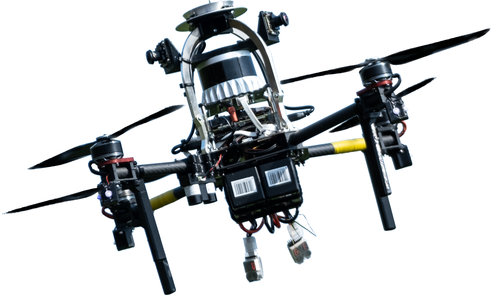
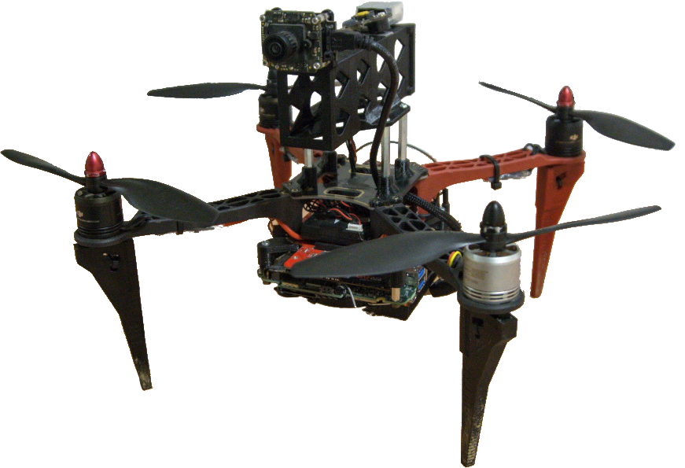

# Heterogeneous UAV dataset for relative localization and cooperative flight

Contains data from the real-world experiments presented in

 * Václav Pritzl, Matouš Vrba, Petr Štěpán, and Martin Saska, **Fusion of Visual-Inertial Odometry with LiDAR Relative Localization for Cooperative Guidance of a Micro-Scale Aerial Vehicle**, *IEEE Robotics and Automation Letters*, 2023, under review.

# UAVs

  
  

# Sensors and topics
The data are provided in the rosbag format. The system time of the UAVs was synchronized using [chrony](https://chrony.tuxfamily.org/) with the primary UAV acting as the server and the secondary UAV acting as the client.

## Primary LiDAR-equipped UAV (left)
The primary UAV was built upon the Holybro X500 frame. It was equipped with the Ouster OS0-128 Rev C 3D LiDAR producing scans of resolution 1024 x 128 beams as 10 Hz.
Use the [Ouster ROS driver](https://github.com/ctu-mrs/ouster) with the `replay` argument to generate `PointCloud2` messages from the lidar_packets.
The `/uav35/odometry/slow_odom` was transmitted from the secondary UAV to the primary UAV over wi-fi using [nimbro_network](https://github.com/ctu-mrs/nimbro_network).

| sensor / content                                                                         | topic                                          | message type                 | rate [Hz] |
|------------------------------------------------------------------------------------------|------------------------------------------------|------------------------------|-----------|
| Ouster OS0-128 Rev C                                                                     | `/uav12/os_cloud_nodelet/imu`                  | `sensor_msgs/Imu`            | 100       |
|                                                                                          | `/uav12/os_nodelet/imu_packets`                | `ouster_ros/PacketMsg`       | 100       |
|                                                                                          | `/uav12/os_nodelet/lidar_packets`              | `ouster_ros/PacketMsg`       | 640       |
| Garmin LIDAR-Lite v3                                                                     | `/uav12/mavros/distance_sensor/garmin`         | `sensor_msgs/Range`          | 85        |
| Pixhawk GPS                                                                              | `/uav12/mavros/global_position/compass_hdg`    | `std_msgs/Float64`           | 100       |
|                                                                                          | `/uav12/mavros/global_position/global`         | `sensor_msgs/NavSatFix`      | 100       |
|                                                                                          | `/uav12/mavros/global_position/local`          | `nav_msgs/Odometry`          | 100       |
|                                                                                          | `/uav12/mavros/global_position/raw/fix`        | `sensor_msgs/NavSatFix`      | 1         |
|                                                                                          | `/uav12/mavros/global_position/raw/gps_vel`    | `geometry_msgs/TwistStamped` | 1         |
|                                                                                          | `/uav12/mavros/global_position/raw/satellites` | `std_msgs/UInt32`            | 1         |
|                                                                                          | `/uav12/mavros/global_position/rel_alt`        | `std_msgs/Float64`           | 100       |
| Pixhawk IMU                                                                              | `/uav12/mavros/imu/data`                       | `sensor_msgs/Imu`            | 100       |
|                                                                                          | `/uav12/mavros/imu/data_raw`                   | `sensor_msgs/Imu`            | 100       |
|                                                                                          | `/uav12/mavros/imu/mag`                        | `sensor_msgs/MagneticField`  | 85        |
|                                                                                          | `/uav12/mavros/imu/static_pressure`            | `sensor_msgs/FluidPressure`  | 19        |
|                                                                                          | `/uav12/mavros/imu/temperature_imu`            | `sensor_msgs/Temperature`    | 19        |
| [ALOAM](https://github.com/ctu-mrs/aloam) LiDAR SLAM odometry                            | `/uav12/slam/odom`                             | `nav_msgs/Odometry`          | 10        |
| secondary UAV odometry in the LiDAR SLAM frame tracked from fusion of LiDAR and VIO data | `/uav12/uav_tf_publisher/tracked_uav`          | `nav_msgs/Odometry`          | 20        |
| VIO of secondary UAV received over wi-fi                                                 | `/uav35/odometry/slow_odom`                    | `nav_msgs/Odometry`          | 2         |
| TFs                                                                                      | `/tf`                                          | `tf2_msgs/TFMessage`         | -         |
| static TFs                                                                               | `/tf_static`                                   | `tf2_msgs/TFMessage`         | -         |

## Secondary camera-equipped UAV (right)
The smaller secondary UAV was built upon the DJI F330 frame.
It carried the mvBlueFOX-MLC200wG monocular camera with DSL217 fisheye lens and the ICM-42688-P IMU for Visual-Inertial Odometry.
It was equipped with the Emlid Reach RTK module providing ground truth measurements.

| sensor / content                                                              | topic                                          | message type                  | rate [Hz] |
|-------------------------------------------------------------------------------|------------------------------------------------|-------------------------------|-----------|
| BlueFOX monocular camera                                                      | `/mv_25003659/image_raw/compressed`            | `sensor_msgs/CompressedImage` | 30        |
| high-rate ICM-42688-P IMU                                                     | `/uav35/vio_imu/imu_raw`                       | `sensor_msgs/Imu`             | 1000      |
|                                                                               | `/uav35/vio_imu/imu_filtered`                  | `sensor_msgs/Imu`             | 1000      |
| RTK Emlid Reach ground truth                                                  | `/uav35/odometry/rtk_local_odom`               | `nav_msgs/Odometry`           | 10        |
| Pixhawk GPS                                                                   | `/uav35/mavros/global_position/compass_hdg`    | `std_msgs/Float64`            | 100       |
|                                                                               | `/uav35/mavros/global_position/global`         | `sensor_msgs/NavSatFix`       | 100       |
|                                                                               | `/uav35/mavros/global_position/local`          | `nav_msgs/Odometry`           | 100       |
|                                                                               | `/uav35/mavros/global_position/raw/fix`        | `sensor_msgs/NavSatFix`       | 1         |
|                                                                               | `/uav35/mavros/global_position/raw/gps_vel`    | `geometry_msgs/TwistStamped`  | 1         |
|                                                                               | `/uav35/mavros/global_position/raw/satellites` | `std_msgs/UInt32`             | 1         |
|                                                                               | `/uav35/mavros/global_position/rel_alt`        | `std_msgs/Float64`            | 100       |
| Pixhawk IMU                                                                   | `/uav35/mavros/imu/data`                       | `sensor_msgs/Imu`             | 100       |
|                                                                               | `/uav35/mavros/imu/data_raw`                   | `sensor_msgs/Imu`             | 100       |
|                                                                               | `/uav35/mavros/imu/mag`                        | `sensor_msgs/MagneticField`   | 85        |
|                                                                               | `/uav35/mavros/imu/static_pressure`            | `sensor_msgs/FluidPressure`   | 19        |
|                                                                               | `/uav35/mavros/imu/temperature_imu`            | `sensor_msgs/Temperature`     | 19        |
| VIO odometry - VINS-Mono                                                      | `/uav35/odometry/odom_vio`                     | `nav_msgs/Odometry`           | 100       |
| throttled VIO odometry (corresponds to the topic received by the primary UAV) | `/uav35/odometry/slow_odom`                    | `nav_msgs/Odometry`           | 2         |
| TFs                                                                           | `/tf`                                          | `tf2_msgs/TFMessage`          | -         |
| static TFs                                                                    | `/tf_static`                                   | `tf2_msgs/TFMessage`          | -         |

[camera_imu_calibration.yaml](./camera_imu_calibration.yaml) contains extrinsic and intrinsic camera-IMU parameters in the format utilized by VINS-Mono config.

# Rosbags

| content             | UAV       | length | size    |
|---------------------|-----------|--------|---------|
| circular flight     | primary   | 339 s  | 5.19 GB |
|                     | secondary | 317 s  | 1.02 GB |
| figure-eight flight | primary   | 521 s  | 7.97 GB |
|                     | secondary | 512 s  | 1.6 GB  |

Run `./download.sh` to download and extract the rosbags, or download them directly from [here](https://nasmrs.felk.cvut.cz/index.php/s/NPYxhU0hch89Jg0).

# Example tmuxinator session

The folder `./tmux/` contains an example tmuxinator session showing how the play the rosbags, generate `PointCloud2` messages from the lidar_packets, and visualize the data in RViz.

